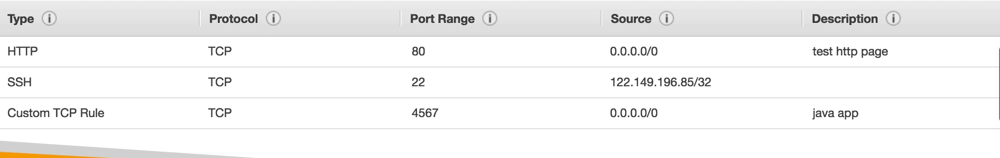

# EC2 FUNDAMENTALS

- **EC2** stands for Elastic Cloud Compute.

---

## EC2 Sizing And Configurations Options

- Operating System (OS): Linux, Windows or MAC OS.
- How much compute power and Cores (CPU).
- How much RAM.
- How much storage space? i.e Network attached(EBS & EFS) or Hardware attched (EC2 Instances Store).
- Network Card; speed of card, Public IP address.
- Firewall rules: security group
- Bootstrap script (Configure at first launch): EC2 User Data.

## Instances are divided into 7 categories

1. General purpose
2. Memory Optimized
3. Accelerated Computing
4. Storage Optimized
5. Instance Features
6. Compute Optimized

---

## Instance naming convention

An example is **m5.2xlarge** where

**m** is Instance Class,

**5** is Generation(AWS improves over time)

**2xlarge** size within the instance class

## Introduction to Security Groups

- Are the fundamentals of network security in AWS.
- They control how traffic is allowed inot or out of our EC2 instances.
- Only contain **"Allow"** rules
- Act as a firewall on our EC2 instances.
- They regulate:
  - Access to ports
  - Authorised IP ranges - IPV4 and IPV6
  - Control both inbound and outbound network.

## EC2 Instances Purchasing Options

- **On-Demand Instances:**

Ideal for short workload, Predictable pricing and it's pay per second.

- **Reserved (1 & 3 yrs):**
  - **Reserved Instances:** Good for workloads that span across a long period.
  - **Convertible Reserved Instances:** Long workloads with flexible instances.
- **Savings Plans (1 & 3 yrs):**

Commitment to an amount of usage, can be ideal for long workloads too.

- **Spot Instances:**

Used for short workloads, cheap but can loose it at any time.

- **Dedicated Hosts:**

Book an entire physical server and control how instances are placed on these physical servers.

- **Dedicated Instances:**

No other customers will share your hardware.

- **EC2 On Demand:**

   You pay for what you use:
  - Linux and Windows - Billing per second , after the first minute.
  - All other OS billing is per hour.

- Has the highest cost but no upfront payment and no long term commitment.

- Recommended for short-term uninterupted workloads, where you can't predict hoe the application will behave.

## Placement Groups

Can be used for control over the EC2 instance placement strategy.

 These strategy can be defined using placement groups.
 Some of these strategies include;

- **Cluster:** Clusters instances into a low-latency group in a single AZ. On the same Rack. Node-to-Node communication that is typical of HPC applications.

- **Spread:** Spreads instances across the underlying hardware i.e 7 isntances per group per AZ and it's good for critical applications. Different hardware. can spread across multiple AZs.

- **Partition:** Spreads instances across many different partitions (which rely on different sets of racks) within an AZ or multiple AZs. Scales to 100s of EC2 instances per group. (Hadoop, Cassandra, Kafka). Distrbuted and replicated workloads. 7 partitions per AZ.

## Elastic Network Interface (ENI)

- Logical component in a VPC that represents a vitual network card.
- Used outside of EC2 instances.

### ENI Attributes

- Have one Primary IPv4, one or more secondary IPv4.
- One Elastic IPv4 per private IPv4.
- One public IPv4.
- One or more security groups.
- Mac address.
- Bound to specific AZ