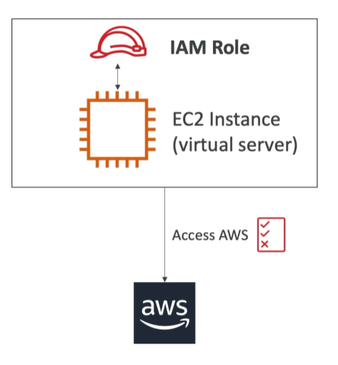

# IAM and AWS CLI

---

## IAM Roles For Services

- Some AWS services need to perform actions or task on your behalf. To do so, we need to assign permissions to AWS Services through **IAM Roles**.

- Some common Roles include;
  
  <ol>
   <li>EC2 Instance Role</li>
   <li>Lambda Function Roles</li>
   <li>Roles for Cloudformation</li>
   </ol>

---

## IAM Credentials Report(Account-level)

- This is a report that lists all the users belonging to your account and the status of their various credentials.

## IAM Access Advisor (User-Level)

- Access advisor shows the service permissions granted to a user and when those services were last used.
- Can help us impliment the principle of least privilege access by revising actions in policies that are not being used.

## IAM GUIDELINES & BEST PRACTICES

1. Don't use root account except for AWS account setup.
2. One physical user = One AWS user.
3. Assign users to groups and assign permissions to groups.
4. Create a strong password policy.
5. Use and enforce the use of MFA(multi-factor authenticator).
6. Create and use Roles for giving permissions to AWS services.
7. Use access keys for programatic access.(sdk/cli).
8. Audit permissions of your account using IAM credentials Report & IAM Access Advisor.
9. **Never share IAM users & Access Keys**
