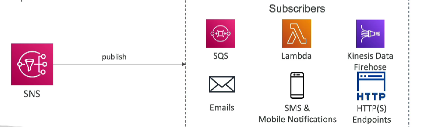

# AWS Solutions Architect

## This repo is notes I find interesting on AWS

Here's an improved version of your README with enhanced formatting and visual elements to make it more engaging:

---

# EC2 Fundamentals

## Table of Contents

1. [Introduction](#introduction)
2. [EC2 Sizing and Configuration Options](#ec2-sizing-and-configuration-options)
3. [Instance Categories](#instance-categories)
4. [Instance Naming Convention](#instance-naming-convention)
5. [Introduction to Security Groups](#introduction-to-security-groups)
6. [EC2 Instances Purchasing Options](#ec2-instances-purchasing-options)
7. [Placement Groups](#placement-groups)
8. [Elastic Network Interface (ENI)](#elastic-network-interface-eni)
9. [EC2 Hibernate](#ec2-hibernate)
10. [EC2 Instance Storage](#ec2-instance-storage)
11. [EBS Snapshots](#ebs-snapshots)
12. [AMI (Amazon Machine Image)](#ami-amazon-machine-image)
13. [EC2 Instance Store](#ec2-instance-store)
14. [EBS Volume Types](#ebs-volume-types)
15. [EBS Multi-Attach](#ebs-multi-attach)
16. [EBS Encryption](#ebs-encryption)
17. [Amazon EFS (Elastic File System)](#amazon-efs-elastic-file-system)
18. [Scalability and High Availability](#scalability-and-high-availability)
19. [Load Balancers](#load-balancers)
20. [Types of Load Balancers on AWS](#types-of-load-balancers-on-aws)
21. [Application Load Balancer](#application-load-balancer)
22. [Network Load Balancer](#network-load-balancer)
23. [Gateway Load Balancer](#gateway-load-balancer)
24. [Sticky Sessions](#sticky-sessions)
25. [Elastic Load Balancer - SSL Certificates](#elastic-load-balancer---ssl-certificates)
26. [Connection Draining](#connection-draining)
27. [Auto Scaling Group](#auto-scaling-group)
28. [AWS RDS Overview](#aws-rds-overview)
29. [Amazon Aurora](#amazon-aurora)
30. [Aurora Replicas](#aurora-replicas)
31. [Aurora Serverless](#aurora-serverless)
32. [Global Aurora](#global-aurora)
33. [Backups](#backups)
34. [RDS & Aurora Restore Options](#rds--aurora-restore-options)
35. [RDS & Aurora Security](#rds--aurora-security)
36. [Amazon RDS Proxy](#amazon-rds-proxy)
37. [ElastiCache Overview](#elasticache-overview)
38. [AWS Route 53](#aws-route-53)
39. [Amazon S3](#amazon-s3)
40. [AWS Storage Extras](#aws-storage-extras)
41. [AWS Snow Family](#aws-snow-family)
42. [Amazon FSx - Overview](#amazon-fsx---overview)
43. [Hybrid Cloud for Storage](#hybrid-cloud-for-storage)
44. [AWS Storage Gateway](#aws-storage-gateway)
45. [Decoupling Applications](#decoupling-applications)
46. [Amazon SQS](#amazon-sqs)
47. [Amazon SNS](#amazon-sns)
48. [Amazon Kinesis](#amazon-kinesis)
49. [Amazon MQ](#amazon-mq)
50. [Containers on AWS](#containers-on-aws)

---

## Introduction

**EC2** stands for Elastic Cloud Compute.

---

## EC2 Sizing and Configuration Options

- **Operating System (OS):** Linux, Windows, or macOS.
- **Compute Power and Cores (CPU):** How much compute power and cores.
- **RAM:** How much RAM.
- **Storage Space:** Network attached (EBS & EFS) or Hardware attached (EC2 Instances Store).
- **Network Card:** Speed of card, Public IP address.
- **Firewall Rules:** Security group.
- **Bootstrap Script (Configure at first launch):** EC2 User Data.

---

## Instance Categories

Instances are divided into seven categories:

1. General Purpose
2. Memory Optimized
3. Accelerated Computing
4. Storage Optimized
5. Instance Features
6. Compute Optimized

---

## Instance Naming Convention

Example: **m5.2xlarge**

- **m:** Instance Class
- **5:** Generation (AWS improves over time)
- **2xlarge:** Size within the instance class

---

## Introduction to Security Groups

- Fundamentals of network security in AWS.
- Control how traffic is allowed into or out of our EC2 instances.
- Only contain **"Allow"** rules.
- Act as a firewall on our EC2 instances.
- Regulate:
  - Access to ports
  - Authorized IP ranges (IPv4 and IPv6)
  - Control both inbound and outbound network.

---

## EC2 Instances Purchasing Options

### On-Demand Instances
- Ideal for short workloads, predictable pricing, and pay per second.

### Reserved Instances (1 & 3 yrs)
- **Reserved Instances:** Good for workloads that span a long period.
- **Convertible Reserved Instances:** Long workloads with flexible instances.

### Savings Plans (1 & 3 yrs)
- Commitment to an amount of usage, ideal for long workloads.

### Spot Instances
- Used for short workloads, cheap but can be lost at any time.

### Dedicated Hosts
- Book an entire physical server and control how instances are placed on these physical servers.

### Dedicated Instances
- No other customers will share your hardware.

### EC2 On Demand
- Pay for what you use:
  - Linux and Windows - Billing per second, after the first minute.
  - All other OS billing is per hour.
- Highest cost but no upfront payment and no long-term commitment.
- Recommended for short-term uninterrupted workloads where you can't predict how the application will behave.

---

## Placement Groups

Placement strategies can be defined using placement groups.

### Strategies

- **Cluster:** Clusters instances into a low-latency group in a single AZ.
- **Spread:** Spreads instances across underlying hardware, good for critical applications.
- **Partition:** Spreads instances across many different partitions (rely on different sets of racks) within an AZ or multiple AZs.

---

## Elastic Network Interface (ENI)

- Logical component in a VPC representing a **virtual network card**.
- Used outside of EC2 instances.
- Provides EC2 instances access to the network.

### ENI Attributes

- One Primary IPv4, one or more secondary IPv4.
- One Elastic IPv4 per private IPv4.
- One public IPv4.
- One or more security groups.
- MAC address.
- Bound to specific AZ.
- Can create ENIs independently from and attach them on the fly to EC2 instances for failover.

---

## EC2 Hibernate

- Preserves the in-memory (RAM) state.
- Instance boot is much faster (the OS is not stopped/restarted).
- Under the hood, the RAM state is written to a file in the root EBS volume.
- Root EBS volume must be encrypted.

### Use Cases

- Long-running processing.
- Saving the RAM state.
- Services that take time to initialize.

### Good to Know

- **Supported Instances Families:** C3, C4, C5, I3, M3, M4, R3, R4, T2, T3.
- **Instance RAM Size:** Must be less than 150GB.
- **Instance Size:** Not supported for bare metal instances.
- **AMIs:** Amazon Linux 2, Linux AMI, Ubuntu, RHEL, CentOS, and Windows.
- **Root Volume:** Must be EBS, encrypted, not instance store and large. Available for On-demand, Reserved, and Spot instances.
- An instance cannot be hibernated more than 60 days.

---

## EC2 Instance Storage

### What is EBS (Elastic Block Store) Volume?

- EBS Volume is a network drive you can attach to your instances while they run.
- Allows your instance to persist data even after termination.
- Bound to a specific AZ.
- Likened to a "network USB stick".
- Free tier: 30GB general type storage (SSD) or magnetic.
- Network drive hence uses the network to communicate, may have some latency.
- Can be detached from one instance and attached to another quickly in case of failover.
- Provisioned capacity (size in GBs and IOPS), billed for all provisioned capacity.
- You can increase the capacity of the drive over time.

---

## EBS Snapshots

- Make a backup (snapshot) of your EBS volume at any given point in time.
- Not necessary to detach volume before doing a snapshot but recommended.
- Can copy snapshots across AZ or Region.

### Features

- **EBS Snapshot Archive:** Move snapshot to an "archive tier" that is 75% cheaper. Takes about 24 to 72 hours for restoring the archive.
- **Recycle Bin for EBS Snapshots:** Setup rules to retain deleted snapshots so you can recover them after an accidental deletion. Specify retention (from 1 day to 1 year).
- **Fast Snapshot Restore:** Force full initialization of snapshot to have no latency on the first use. Costly ($$).

---

## AMI (Amazon Machine Image)

- AMI is a customization of an EC2 instance.
  - You add your own software, OS, monitoring.
  - Faster boot/configuration time because all your software is pre-packaged.
- AMIs are built for specific regions (can be copied from one region to another).
-

 Instances can be launched from:
  - **Public AMI:** Provided by AWS.
  - **Owned AMI:** Managed and maintained by yourself.
  - **AWS Marketplace AMI**

---

## EC2 Instance Store

- EBS volumes are network drives with good but limited performance.
- If you need a high-performance hardware disk, use EC2 Instance Store.
- Better I/O performance.
- EC2 Instance Store loses its storage if stopped (ephemeral).
- Good for buffer/cache/scratch data/temporary content.

---

## EBS Volume Types

- EBS volumes come in six types:
  - **gp2/gp3 (SSD):** General purpose SSD volume. Balances price and performance for a wide variety of workloads.
  - **io1/io2 (SSD):** Highest-performance SSD volume for mission-critical low-latency or high-throughput workloads.
  - **st1 (HDD):** Low-cost HDD volume designed for frequently accessed, throughput-intensive workloads.
  - **sc1 (HDD):** Lowest-cost HDD volume designed for less frequently accessed workloads.
- EBS volumes are characterized by size, throughput, and IOPS (I/O Ops Per Sec).

---

## EBS Multi-Attach

- Attach the same EBS volume to multiple EC2 instances in the same AZ.
- Each instance has full read and write permissions to the high-performance volume.
- Use Case:
  - Achieve higher application availability in clustered Linux applications (e.g., Teradata).
  - Applications must manage concurrent write operations.
- Up to 16 EC2 instances at a time.
- Must use a file system that's cluster-aware (not XFS, EXT4, etc.).

---

## EBS Encryption

- When you encrypt your EBS volume, you get the following:
  - Data at rest is encrypted inside the volume.
  - All data in flight between the instance and the volume is encrypted.
  - All snapshots are encrypted.
  - All volumes created from the snapshots are encrypted too.
- Encryption and decryption are handled transparently.
- Encryption has minimal impact on latency.
- EBS encryption leverages keys from KMS (AES-256).
- Copying an unencrypted snapshot allows encryption.
- Snapshots of encrypted volumes are encrypted.

### How to Encrypt an Unencrypted EBS Volume?

1. Create an EBS snapshot of the volume.
2. Encrypt the EBS snapshot (using copy).
3. Create a new EBS volume from the snapshot (the volume will be encrypted).
4. Attach the encrypted volume to the original instance.

---

## Amazon EFS (Elastic File System)

- Managed Network File System (NFS) that can be mounted on many EC2 instances.
- EFS works with EC2 instances in multi-AZ.
- Highly available, scalable, expensive (3x gp2), pay per use.

### Use Cases

- Content management, web serving, data sharing, WordPress.
- Uses NFSv4.1 protocol.
- Uses security groups to control access to EFS.
- Compatible with Linux-based AMIs (not Windows).
- Encryption at rest using KMS.
- POSIX file system (~Linux) that has the standard file API.
- File system scales automatically, pay-per-use, no capacity planning.

---

## Scalability and High Availability

- Scalability means that an application/system can handle greater workloads by adapting.
- Two kinds:
  - **Vertical Scalability**
  - **Horizontal Scalability (Elasticity)**

### Vertical Scalability

- Increasing the size of the instance.
- Example: scaling your instance from t2.micro to t3.large.
- Common for non-distributed systems such as databases. RDS and ElastiCache can scale vertically too.
- Has hardware limits.

### Horizontal Scalability

- Increasing the number of instances/systems for your application.
- Horizontal scaling implies distributed systems, common with modern web applications.

### High Availability

- Usually goes hand in hand with horizontal scaling.
- High availability means running your application/system in at least two data centers (==AZ).
- Goal is to survive data center loss.
- HA can be passive (RDS multi-AZ) or active (horizontal scaling).

---

## Load Balancers

- LBs are servers that forward traffic to multiple servers.

### Why Use Load Balancers?

- Spread load across multiple downstream instances.
- Expose a single point of access (DNS) to your application.
- Seamlessly handle failures of downstream instances.
- Regular health checks to your instances.
- Provide SSL termination (HTTPS) for your website.
- Enforce stickiness with cookies.
- High availability across zones.
- Separate public traffic from private traffic.

---

## Types of Load Balancers on AWS

- **Classic Load Balancer (CLB):** v1 - old generation from 2009.
- **Application Load Balancer (ALB):** v2 - new generation from 2016.
- **Network Load Balancer (NLB):** v2 - new generation from 2017.
- **Gateway Load Balancer (GWLB):** Operates at layer 3 network layer - IP protocol, from 2020.

---

## Application Load Balancer

- ALB is a layer 7 (HTTP).
- Load balancing to multiple HTTP applications across machines (target groups).
- Can be used to load balance multiple applications on the same machine (e.g., containers like ECS).
- Support for HTTP/2 and WebSocket.
- Supports redirect (HTTP to HTTPS at the load balancer level).
- Routing tables to different target groups:
  - Routing based on path in URL (example.com/users & example.com/posts).
  - Routing based on hostname in URL (one.example.com & other.example.com).
  - Routing based on Query String, Headers (example.com/users?id=123&order=false).
- ALBs are great for microservices & container-based applications (e.g., Docker & ECS).
- Has a port mapping feature to redirect to a dynamic port in ECS.

### ALB Target Groups

- EC2 Instances (managed by ASG) - HTTP.
- ECS tasks (managed by ECS itself) - HTTP.
- Lambda functions - HTTP request is translated into a JSON event.
- IP Addresses - Must be private IPs.
- ALB can route to multiple target groups.
- Health checks are at the target group level.

---

## Network Load Balancer

- It's a layer 4.
  - Forwards TCP and UDP traffic to your instances.
  - High performance compared to the ALB and handles millions of requests per second.
  - Less latency ~100ms (vs. 400ms for ALB).
- NLB has one static IP per AZ and supports assigning Elastic IP (helps in whitelisting specific IP).

### NLB Target Groups

- EC2 instances.
- IP addresses.
- Application Load Balancer.
- Health checks support the TCP, HTTP, and HTTPS protocols.

---

## Gateway Load Balancer (GWLB)

- Deploy, scale, and manage a fleet of 3rd party network virtual appliances in AWS.
- Examples include: Firewalls, Intrusion Detection and Prevention Systems, Deep Packet Inspection Systems, Payload Manipulation.
- Operates at layer 3 (Network Layer) IP Packets.
- Combines the following functions:
  - Transparent Network Gateway - Single entry/exit for all traffic.
  - Load Balancer - Distributes traffic to your virtual appliances.
- Uses GENEVE protocol on port 6081.

### GWLB Target Groups

- EC2 instances.
- IP addresses - Must be private IPs.

---

## Sticky Sessions (Session Affinity)

- Enables the same client to always be redirected to the same instance behind the load balancer.
- Works for Network Load Balancers (works without cookies) and Application Load Balancers.
- The "cookie" used for stickiness has an expiration date you control.
- Enabling stickiness may bring imbalance to the load over the backend EC2 instances.

### Cookie Names

- **Application-based Cookies:**
  - Custom cookie: Generated by the target, can include any custom attributes required by the application.
  - Application cookie: Generated by the load balancer, Cookie name is AWSALBAPP.

- **Duration-based Cookies:**
  - Cookie generated by the load balancer.
  - Cookie name is AWSALB for ALB, AWSELB for CLB.

---

## Elastic Load Balancer - SSL Certificates

- An SSL Certificate allows traffic between your clients and load balancer to be encrypted in transit (in-flight encryption).
- **SSL:** Secure Sockets Layer, used to encrypt connections.
- **TLS:** Transport Layer Security, newer version of SSL.
- Public SSL certs are issued by certificate authorities (CA) like Comodo, Symantec, GoDaddy, GlobalSign, Digicert, Letsencrypt, etc.
- Load balancer uses an X.509 certificate (SSL/TLS server cert.).

### Server Name Indication (SNI)

- Solves the problem of loading multiple SSL certificates onto one web server to serve multiple websites.
- Requires the client to indicate the hostname of the server in the initial SSL handshake.
- Server will find the certificate or return the default one.

**Note:** Only works for ALB, NLB (newer generation), and CloudFront.

---

## Connection Draining

### Feature Naming

- **Connection Draining:** For CLB.
- **Deregistration Delay:** For ALB & NLB.

- Time to complete "in-flight requests" while the instance is deregistered or unhealthy.
- Stops sending new requests to the EC2 instance which is deregistering.
- Between 1 to 3600 seconds (default: 300 seconds).

---

## Auto Scaling Group

- Automatically increase/decrease the desired number of EC2 instances.
- Ensure a minimum and maximum number of

 instances are running.
- Register new instances to a load balancer automatically.
- Re-create an instance if it is terminated due to being unhealthy.
- Free (only pay for the underlying instances).

### ASG Attributes

- **Launch Template:** Needed to automatically spin up new instances in your ASG. It includes:
  - AMI + Instance Type.
  - EC2 User Data.
  - EBS Volumes.
  - Security Groups.
  - SSH Key Pair.
  - IAM Roles for your EC2 Instances.
  - Network + Subnets Information.
  - Load Balancer Information.
- **Min and Max Size:** Defines the minimum and maximum number of instances.
- **Scaling Policies:** Using CloudWatch alarms.

---

## AWS RDS Overview

- **RDS = Relational Database Service.**
- Managed DB service for DBs using SQL as a query language.
- Allows you to create databases in the cloud managed by AWS, including:
  - PostgreSQL
  - MySQL
  - MariaDB
  - Oracle
  - Microsoft SQL Server
  - Aurora (AWS Proprietary database)

### Advantages of AWS RDS

- **Managed Service:**
  - Automated provisioning and OS patching.
  - Continuous backups and restore to specific timestamps (point-in-time restore).
  - Monitoring dashboards.
  - Read replicas for improved read performance.
  - Multi-AZ setup for disaster recovery (DR).
  - Maintenance windows for upgrades.
  - Scaling capability (both vertical and horizontal).
  - Storage backed by EBS (gp2 or io1).
- **Limitations:**
  - You can't SSH into your instances.

---

## Amazon Aurora

- Proprietary technology from AWS (not open-sourced).
- PostgreSQL and MySQL are supported as Aurora DBs (drivers will work as if Aurora was PostgreSQL or MySQL).
- AWS cloud optimized, claims 5x performance improvement over MySQL, 3x performance over PostgreSQL on RDS.
- Storage automatically grows in increments of 10GB up to 128TB.
- Aurora can have up to 15 replicas and the replication process is faster than MySQL (sub 10 ms replica lag).
- Instantaneous failover, HA native.
- Costs more than RDS (20% more) but is more efficient.

---

## Aurora Replicas

### Auto Scaling

- Writer endpoint attached to the primary DB.
- Reader endpoint on the read replicas, which can be extended as the read replicas can be scaled out.

### Custom Endpoints

- When you have different types of read replicas, you can define a subset of your Aurora instances as a custom endpoint.
  - Example: Running analytical queries on specific replicas.
- The reader endpoint is generally not used after defining custom endpoints.

---

## Aurora Serverless

- Automated database instantiation and auto-scaling based on actual usage.
- Good for infrequent, intermittent, or unpredictable workloads.
- No capacity planning needed and pay-per-second can be more cost-effective.

---

## Global Aurora

- **Aurora Cross Region Read Replicas:**
  - Useful for disaster recovery.
  - Simple to put in place.
- **Aurora Global Database (recommended):**
  - 1 Primary region (read/write).
  - Up to 5 secondary (read-only) regions, replication lag is less than 1 second.
  - Up to 16 read replicas per secondary region.
  - Helps in decreasing latency.
  - Promoting another region (for disaster recovery) has an RTO < 1 min.
  - Typical cross-region replication takes less than 1 second.

---

## Backups

### RDS Backups

- **Automated Backups:**
  - Daily full backup of the database (during the backup window).
  - Transactions logs are backed up by RDS every 5 minutes.
  - Ability to restore to any point in time (from the oldest backup to 5 minutes ago).
  - 1 to 35 days of retention, set 0 to disable automated backups.
- **Manual DB Snapshots:**
  - Manually triggered by the user.
  - Retention of backup for as long as you want.
  - Tip: For a stopped RDS database, you will pay for storage. If you plan on stopping it for a long time, snapshot and restore instead.

### Aurora Backups

- **Automated Backups:**
  - 1 to 35 days (cannot be disabled).
  - Point-in-time recovery within that timeframe.
- **Manual DB Snapshots:**
  - Manually triggered by the user.
  - Retention of backup for as long as you want.

---

## RDS & Aurora Restore Options

- **Restoring a RDS / Aurora Backup or Snapshot:**
  - Creates a new DB.

- **Restoring MySQL RDS Database from S3:**
  - Create a backup of your on-premises DB.
  - Store it on Amazon S3.
  - Restore the backup file onto a new RDS instance running MySQL.

- **Restoring MySQL Aurora Cluster from S3:**
  - Create a backup of your on-prem DB using Percona XtraBackup.
  - Store the backup file on Amazon S3.
  - Restore the backup file onto a new Aurora cluster running MySQL.

---

## Aurora Database Cloning

- You can create a new Aurora DB cluster from an existing one.
- Faster than snapshot and restore.
- Uses *copy-on-write* protocol:
  - Initially, the new DB cluster uses the same data volume as the original DB cluster (fast and efficient - no copying is needed).
  - When updates are made to the new DB cluster data, then additional storage is allocated and the data is copied to be separated.
- Very fast and cost-effective.
- Useful to create a "staging" database from a "production" DB without impacting the production database.

---

## RDS & Aurora Security

- **At-rest Encryption:**
  - DB master and replicas encryption using AWS KMS (must be defined at launch time).
  - If the master is not encrypted, the read replicas cannot be encrypted.
  - To encrypt an un-encrypted DB, go through a DB snapshot and restore as encrypted.
- **In-flight Encryption:**
  - TLS-ready by default, use the AWS TLS root certificates client-side.
- **IAM Authentication:**
  - Use IAM roles to login or connect to your database (instead of username/passwords).
- **Security Groups:**
  - Control network access to your RDS / Aurora DB.
- **No SSH Access:**
  - RDS and Aurora are managed services, no SSH access except on *RDS Custom service*.
- **Audit Logs:**
  - Can be enabled and sent to CloudWatch logs for longer retention.

---

## Amazon RDS Proxy

- Fully managed DB proxy for RDS.
- Allows apps to pool and share DB connections established with the DB.
- Improves DB efficiency by reducing the stress on database resources (e.g., CPU, RAM) and minimizes open connections (and timeouts).
- Serverless, auto-scaling, highly available (multi-AZ).
- Reduced RDS and Aurora failover time by up to 66%.
- Supports RDS (MySQL, PostgreSQL, MariaDB, MS SQL server) and Aurora (MySQL, PostgreSQL).
- No code changes required for most apps.
- Enforce IAM Authentication for DB and securely store credentials in AWS Secrets Manager.
- RDS Proxy is never publicly accessible (must be accessed from VPC).

---

## ElastiCache Overview

- Caches are in-memory databases with high performance, low latency.
- ElastiCache provides managed Redis or Memcached.
- Reduces load off DB for read-intensive workloads and makes your applications stateless.
- AWS handles OS patches, maintenance, optimization, setup, configuration, monitoring, failure recovery, and backups.
- Using ElastiCache involves heavy application code changes.

### Solution Architecture

**DB Cache:**

**User Session Store:**

### Security

- **Redis AUTH:**
  - Set a "password/token" when creating a Redis cluster.
  - Extra security for your cache (on top of security group).
  - Supports SSL in-flight encryption.
- **Memcached:**
  - Supports SASL-based authentication (advanced).

---

## AWS Route 53

### DNS Terminologies

- **Domain Registrar:** GoDaddy, Amazon Route 53.
- **DNS Records:** A, AAAA, CNAME, NS, ALIAS.
- **Zone File:** Contains our DNS records.
- **Name Server:** Resolves DNS queries (Authoritative or Non-Authoritative).
- **Top-Level Domain (TLD):** .com, .us, .in, .gov, .org.
- **Second-Level Domain (SLD):** amazon.com, google.com.

### How Does a DNS Server Work?

### Route 53 - Records TTL (Time To Live)

- **Higher TTL (e.g., 24hr):**
  - Less traffic on Route 53.
  - Possibly outdated records.

- **Lower TTL (e.g., 60secs):**
  - More traffic on Route 53 ($$).
 

 - Records are outdated for less time.
  - Easy to change records.

- **Note:** Except for Alias records, TTL is mandatory for each DNS record.

---

## CNAME vs Alias

AWS resources (LB, CloudFront) expose an AWS hostname: *lb-1234.us-east-2.elb.amazonaws.com* and you want *myapp.mydomain.com*.

### CNAME:

- Points a hostname to any other hostname. e.g., app.mydomain.com => web.blabla.com.
- **ONLY FOR NON-ROOT DOMAIN (aka.something.mydomain.com)**.

### Alias:

- Points a hostname to an AWS Resource (app.mydomain.com => blalbla.amazonaws.com).
- Works for both ROOT DOMAIN and NON-ROOT DOMAIN (aka mydomain.com).
- Free of charge.
- Native healthcare capability within them.

### Alias Records

- Maps a hostname to an AWS resource.
- Extension to DNS functionality.
- Automatically recognizes changes in the resource's IP addresses.
- Unlike CNAME, it can be used for the top node of a DNS namespace (Zone Apex) e.g., example.com.
- Alias Record is always of type A/AAAA for AWS resources (IPv4 / IPv6).
- You can't set the TTL.

---

## Alias Records Targets

- Elastic Load Balancers.
- CloudFront Distributions.
- API Gateway.
- Elastic Beanstalk environments.
- S3 websites.
- VPC interface Endpoints.
- Global Accelerator.
- Route 53 record in the same hosted zone.

---

## Routing Policies

### Simple Routing

- Typically route traffic to a single resource.
- Can specify multiple values in the same record.
- If multiple values are returned, a random one is chosen by the client.
- When alias is enabled, specify only one AWS resource.
- Can't be associated with health checks.

### Weighted Routing

- Control the number or % of requests that go to a particular resource.
- DNS records must have the same name and type.
- Can be associated with health checks.

### Latency-based Routing

- Redirect to the resource that has the least latency close to us.
- Super helpful when latency for users is a priority.
- **Latency is based on traffic between users and AWS regions.**
- Can be combined with health checks and has failover capacity.

---

### Route 53 - Health Checks

- HTTP Health checks are only for public resources.
- **Health Check => Automated DNS Failover:** There are different kinds.
  - Health checks that monitor an endpoint (application, server, other AWS resources).
  - Health checks that monitor other health checks (Calculated Health Checks).
  - Health checks that monitor CloudWatch alarms (full control). e.g., throttles of DynamoDB, alarms on RDS, custom metrics (helpful for private resources).
- Health Checks are integrated with CloudWatch metrics.

---

## Routing Policies

### Failover (Active-Passive)

### Geolocation

- Different from latency-based.
- **Routing is based on user location.**
- Specify location by continent, country, or US state (if overlapping, more precise location selected).
- Should create a "Default" record (in case there's no match on location).
- Use Cases: Website localization, restrict content distribution, load balancing.
- Can be associated with health checks.

### Geoproximity Routing

- Route traffic based on the geographic location of users and resources.
- Ability to shift more traffic to resources based on the defined bias.
- To change the size of the geographic region, specify bias values:
  - Expand (1 to 99) - More traffic to the resource.
  - Shrink (1 to 99) - Less traffic to the resource.
- Resources can be:
  - AWS Resources (specify AWS region).
  - Non-AWS Resources (specify Latitude and Longitude).
- You must use Route 53 Traffic Flow (advanced) to use this feature.

### IP-based Routing

- Routing is based on client IP addresses.
- Provide a list of CIDRs for your clients and the corresponding endpoints/locations (user-IP-to-endpoint mappings).
- Use Case: Optimize performance and reduce network costs. e.g., route end-users from a particular ISP to a specific endpoint.

### Multi-Value Routing

- Use when routing traffic to multiple resources and can be associated with health checks.
- Up to 8 healthy records are returned for each multi-value query, and Route 53 returns multiple values/resources.
- **Not a substitute for having an ELB.**

---

## Elastic Beanstalk

- Developer-centric view of deploying applications on AWS.
- Uses all the components we've seen before, such as EC2, ASG, ELB, RDS, etc.
- Also a managed service.
  - Automatically handles capacity provisioning, load balancing, scaling, application health monitoring, instance configuration.
  - Just the application code is the responsibility of the developer.
- Still have full control over the configuration.
- Beanstalk is free, but you pay for the underlying instances.

### Components

- **Application:** Collection of Elastic Beanstalk components (environments, versions, configurations, ...).
- **Application Version:** An iteration of your application code.
- **Environment:** Collection of AWS resources running an application version (only one application version at a time).
  - **Tiers:** Web Server Environment Tier & Worker Environment Tier.
  - Create multiple environments (dev, test, prod, ...).

---

## Amazon S3

### Use Cases

- For backup and storage.
- Disaster Recovery.
- Archive.
- Hybrid Cloud Storage.
- Application Hosting.
- Media Hosting.
- Data Lakes & Big Data Analytics.
- Software Delivery.

### Buckets

- S3 allows you to store objects (files) in buckets (directories).
- Buckets must have a **globally unique name** (across all regions and accounts).
- Looks like a global service but buckets are created in regions and are defined at the region level.
- **Naming Convention:**
  - No uppercase, No underscore.
  - 3 to 63 characters long.
  - Not an IP.
  - Must start with a lowercase letter or number.
  - Must NOT start with prefix **xn--**.
  - Must NOT end with suffix **-s3alias**.

### Objects

- Object values are the content of the body:
  - Max Object size is 5TB (5000GB).
  - If uploading more than 5GB, must use "multi-part upload".

### Security

- **User-based:**
  - **IAM Roles:** Determine which API calls should be allowed for a specific user from IAM.
- **Resource-Based:**
  - **Bucket Policies:** Bucket-wide rules from the S3 console (allows cross-account).
  - **Object Access Control List (ACL):** Fine-grained (can be disabled).
  - **Bucket Access Control List (ACL):** Less common (can be disabled).
- **Encryption:** S3 buckets can be encrypted using encryption keys.

---

## S3 Storage Classes

1. **Amazon S3 Standard - General Purpose:**
   - 99.99% availability.
   - Used for frequently accessed data.
   - Low latency and high throughput.
   - Sustain 2 concurrent facility failures.
   - Use Case: Big data analytics, mobile & gaming applications, content distribution.

2. **Amazon S3 Standard - Infrequent Access (IA):**
   - For data less frequently accessed but requires rapid access when needed.
   - Lower cost than S3 Standard but cost on retrieval.
   - 99.99% availability.
   - Use Case: Disaster Recovery (DR) and backups.

3. **Amazon S3 One Zone - Infrequent Access:**
   - High durability (99.999%) in a single AZ, data lost when AZ is destroyed.
   - 99.5% availability.
   - Use Case: Storing secondary backup copies of on-premise data or data you can recreate.

4. **Amazon S3 Glacier Instant Retrieval:**
   - Millisecond retrieval, great for data accessed once a quarter.
   - Minimum storage duration of 90 days.

5. **Amazon S3 Glacier Flexible Retrieval (formerly Amazon S3 Glacier):**
   - Expedited (1 to 5min), Standard (3 to 5hrs), Bulk (5 to 12hrs) - Free.
   - Minimum storage duration of 90 days.

6. **Amazon S3 Glacier Deep Archive:**
   - Good for long-term storage.
   - Standard (12 hrs), Bulk (48 hrs).

7. **Amazon S3 Intelligent-Tiering:**
   - Small monthly monitoring and auto-tiering fee.
   - Moves objects automatically between access tiers based on usage.
   - No retrieval charges in S3 Intelligent-Tiering.
     - Frequent Access tier (automatic): Default tier.
     - Infrequent Access tier (automatic): Objects not accessed for 30 days.
     - Archive Instant Access tier (automatic): Objects not accessed for 90 days.
     - Archive Access tier (optional): Configurable from 90 days to 700+ days.

- **You can use S3 lifecycle configurations to move objects between the classes above.**

### Lifecycle Rules

- **Transition Actions:** Configure objects to transition to another storage class.
  - Move object to Standard IA class 60

 days after creation.
  - Move to Glacier for archiving after 6 months.

- **Expiration Actions:** Configure objects to expire (delete) after a certain period.
  - Access log files can be set to delete after 365 days.
  - Delete old versions of files (if versioning is enabled).
  - Delete incomplete Multi-Part uploads.
- Rules can be created for a certain prefix (e.g., s3://mybucket/mp3/*).
- Rules can be created for certain object Tags (e.g., Department: Finance).

### Requester Pays

- In general, bucket owners pay for all S3 storage and data transfer costs associated with their bucket.
- **With Requester Pays Buckets**, the requester instead of the owner pays for the cost of the request and the data download from the bucket.
- Helpful when you want to share large datasets with other accounts.
- The requester must be authenticated in AWS (can't be anonymous).

---

## S3 - Object Encryption

Can encrypt objects in S3 using four methods.

### Server-side Encryption (SSE)

1. **SSE-S3:** Server-side encryption with Amazon S3-managed Keys (enabled by default). Encrypts S3 objects using keys handled, managed, and owned by AWS.
2. **SSE-KMS:** Server-side encryption with KMS keys stored in AWS KMS. Leverages AWS Key Management Service (AWS KMS) to manage encryption keys.
3. **SSE-C:** Server-side encryption with customer-provided keys. Customers provide their own keys to use for encryption of objects in S3.

### Client-Side Encryption

- Use client libraries such as Amazon S3 Client-Side Encryption Library.
- Clients must encrypt data themselves before sending it to Amazon S3 and decrypt data before retrieving it from S3.
- Customer fully manages the keys and encryption cycle.

### Encryption in Transit (SSL/TLS)

- Encryption in flight is also called SSL/TLS.
- Amazon S3 exposes two endpoints:
  - **HTTP Endpoint:** Non-encrypted.
  - **HTTPS Endpoint:** Encrypted.
- HTTPS is recommended.
- HTTPS is mandatory for SSE-C (customer-provided keys).

---

## What is CORS?

**CORS** stands for **Cross-Origin Resource Sharing**.

- **Origin:** Scheme (protocol) + Host (domain) + Port. Example: `https://www.example.com` (implied port is 443 for HTTPS, 80 for HTTP).
- CORS is a web browser mechanism to allow requests to other origins while visiting the main origin.

---

## MFA Delete

**MFA** is required to:

- Permanently delete an object version.
- Suspend versioning on the bucket.

**MFA** is not required to:

- Enable versioning.
- List deleted versions.

**To use MFA Delete:**

- Versioning must be enabled on the bucket.
- Only the bucket owner (root account) can enable/disable MFA Delete.

---

## S3 Access Logs

- For audit purposes, log all access to S3 buckets.
- Any request made to any account, whether accepted or denied, will be logged into the logs bucket for the data to be analyzed using data analysis tools.
- The target logging bucket must be in the same AWS region.

---

## S3 Glacier Vault Lock

- Adopt a WORM (Write Once Read Many) model.
- Create a vault lock policy.
- Lock the policy from future edits (can't be changed or deleted).
- Helpful for compliance and data retention.

---

## AWS CloudFront and AWS Global Accelerator

### What is AWS CloudFront?

- It's a content delivery network (CDN).
- Improves read performance; content is cached at the edge locations.
- Improves user experience.
- DDoS protection (because it's worldwide), integrated with Shield, AWS WAF.

---

## AWS Storage Extras

### AWS Snow Family

- Highly secure and portable devices used by AWS to collect and process data at the edge and for data migration in and out of AWS.
- **For Data Migration:**
  - Snowcone.
  - Snowball Edge.
  - Snowmobile.
- **Edge Computing:**
  - Snowcone.
  - Snowball Edge.

---

### Snowball Edge (for data transfers)

- Physical hardware solution used for transporting large data (terabytes or petabytes) in and out of AWS.
- Good alternative to moving data over the network, which can cost a lot in network fees.
- Pay per data transfer job.
- **Types:**
  - **Storage Optimized:** 80 TB HDD or 210 TB NVMe for block volume and S3-compatible object storage.
  - **Compute Optimized:** 42 TB HDD or 28 TB NVMe capacity for block volume and S3-compatible object storage.

**Use Cases:**

- Data cloud migrations.
- Data center decommissioning.
- Disaster recovery.

---

### AWS Snowcone & Snowcone SSD

- Small and portable, can withstand harsh environments, very secure.
- Light (about 4.5 lbs or 2.1 kg).
- Device for edge computing, storage, and data transfer.
- **Types:**
  - **Snowcone:** 8TB of HDD storage.
  - **Snowcone SSD:** 14TB of SSD storage.
- Can be used where Snowball does not fit (confined space). Requires own batteries.
- Can be sent back to AWS offline or connected to the internet to use AWS DataSync to send data.

---

### AWS SnowMobile

- It's an actual truck, very secure, comes with 24/7 surveillance.
- Transfer exabytes of data (1 exabyte = 1000 petabyte = 1,000,000 terabytes).
- Each Snowmobile has 100 PB of capacity (use multiple in parallel).

---

## Amazon FSx - Overview

- 3rd party high-performance file systems on AWS.
- Fully managed service.
- Examples include:
  - **FSx for Lustre.**
  - **FSx for Windows File Server.**
  - **FSx for NetApp ONTAP.**
  - **FSx for OpenZFS.**

---

## Hybrid Cloud for Storage

- AWS is pushing for "hybrid cloud."
- **Reasons:**
  - Long cloud migration time.
  - Security requirements.
  - Compliance requirements.
  - IT strategy.
- **S3 is proprietary storage technology (unlike EFS/NFS), so how do you expose S3 data on-prem? Use AWS Storage Gateway.**

---

## AWS Storage Cloud Native Options

- **BLOCK:** Amazon EBS & EC2 instance store.
- **FILE:** Amazon EFS & Amazon FSx.
- **OBJECT:** Amazon S3 & Amazon Glacier.

---

## AWS Storage Gateway

- Bridge between on-prem data and cloud data.
- **Use Cases:**
  - Disaster recovery.
  - Backup and restore.
  - Tiered storage.
  - On-prem cache and low latency files access.
- **Types:**
  - S3 file gateway.
  - FSx file gateway.
  - Volume gateway.
  - Tape gateway.

---

### AWS Transfer Family

- Fully-managed service for file transfers into and out of Amazon S3 or Amazon EFS using FTP protocol.
- **Supported Protocols:**
  - AWS Transfer for FTP (File Transfer Protocol).
  - AWS Transfer for FTPS (File Transfer Protocol over SSL).
  - AWS Transfer for SFTP (Secure File Transfer Protocol).
- Managed infrastructure, scalable, reliable, highly available (multi-AZ).
- Pay per provisioned endpoint per hour plus data transfers in GB.
- Store and manage users' credentials within the service.
- Integrate with existing authentication systems (Microsoft Active Directory, LDAP, Okta, Amazon Cognito, Custom).
- **Use Cases:** Sharing files, public datasets, CRM, ERP.

---

## AWS DataSync

- Move large amounts of data to and from:
  - On-prem / other cloud to AWS (NFS, SMB, HDFS, S3 API). Requires an agent to run on-prem or the other cloud.
  - AWS to AWS (different storage services). Requires no agent.
- Can synchronize to:
  - Amazon S3 (any storage class - including Glacier).
  - Amazon EFS.
  - Amazon FSx (Windows, Lustre, NetApp, OpenZFS).
- Replication tasks can be scheduled hourly, daily, weekly.
- Ability to keep file permissions and metadata preserved (NFS POSIX, SMB).
- One agent task can use 10Gbps, and you can set up a bandwidth limit.

---

## Decoupling Applications: SQS, SNS, Kinesis, Active MQ

### Introduction

- Forms of communications:
  1. **Synchronous Communications (Application to Application):**
     
  2. **Asynchronous/Event-based Communications (Application to Queue Application):**
     

---

## Amazon SQS (Simple Queue Service)

**What is a Queue?**

- Producers send messages to the queue, and consumers poll messages from the queue and delete the message from the queue.

- The oldest AWS offering.
- Fully managed service, used to decouple applications.
- **Features:**
  - Unlimited throughput, unlimited number of messages in the queue.
  - Default retention of messages is 4 days, max of 14 days.
  - Very low latency (< 10ms on publish and receive).
  - Messages can be delivered twice or duplicated (at least once on delivery).
  - Can have out-of-order messages (best effort

 offering).

---

## Amazon SNS (Simple Notification Service)

- Ideal for sending one message to many receivers (e.g., a buying service sending notifications to multiple services).

- "Event producer" sends only one message to one SNS topic.
- Can have as many "event receivers" (subscriptions) as desired.
- Each subscriber to the topic will get all messages (new feature to filter messages available).
- Up to 12.5 million subscriptions per topic.
- 100,000 SNS topic limit.

---

## Amazon Kinesis

- Makes it easy to collect, process, and analyze streaming data in real-time.
- Data streams can include application logs, metrics, website clickstreams, IoT telemetry data.

**Services:**

- **Kinesis Data Streams:** Capture, process, and store data streams.
- **Kinesis Data Firehose:** Load data streams into AWS data stores.
- **Kinesis Data Analytics:** Analyze data streams with SQL or Apache Flink.
- **Kinesis Video Streams:** Capture, process, and store video streams.

### Capacity Mode

- **Provisioned Mode:** Choose the number of shards, scaled manually or using API.
  - Each shard: 1MB/s in (or 1000 records per second), 2MB/s out.
- **On-Demand Mode:** No need to manage capacity.
  - Default capacity: 4MB/s in (or 4000 records per second).
  - Scales automatically based on observed throughput peak during the last 30 days.
  - Pay per stream per hour and data in/out per GB.

---

## Containers on AWS (ECS, Fargate, ECR & EKS)

### Amazon ECS (Elastic Container Service)

- Fully managed container orchestration service.
- Helps you deploy, manage, and scale containerized applications.
- Integrated with AWS and third-party tools, such as Amazon Elastic Container Registry and Docker.
- Run and scale container workloads across AWS regions in the cloud and on-premises, without managing a control plane.

### Launch Types

- **EC2 Instances:** Provision and maintain infrastructure (EC2 instances with ECS agents).
- **Fargate (Serverless):** Managed by AWS, no need to manage underlying infrastructure.

